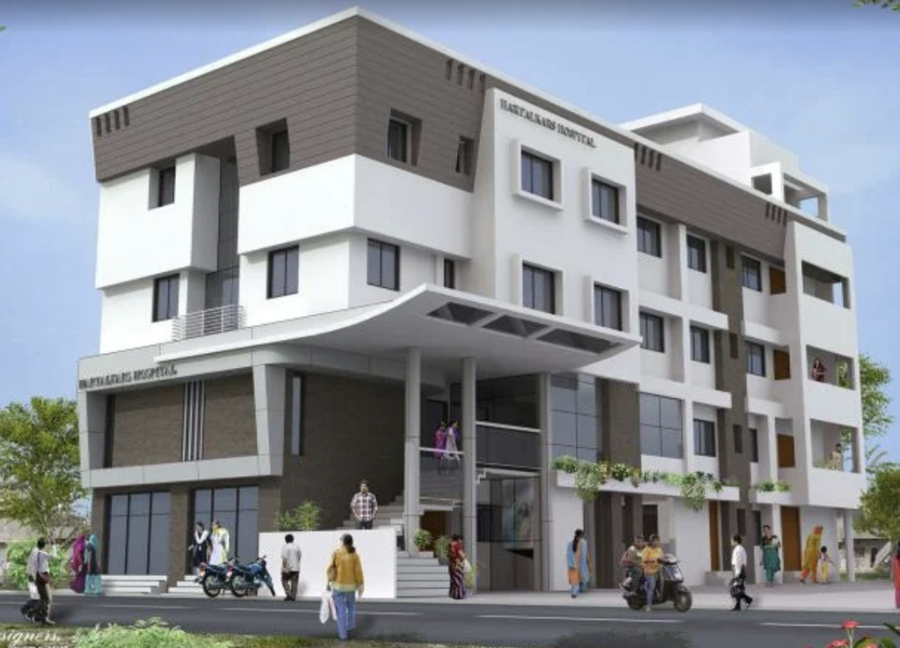

# Hartalkar Hospital Website

A premium, modern, and responsive healthcare website built for Hartalkar Hospital. Designed to reflect trust, compassion, and structural excellence.



## 🏥 Overview

This project is a single-page React application that showcases the hospital's legacy, services, doctors, and facilities. It features a high-impact visual design with smooth animations, interactive elements, and focused accessibility.

### Key Features
-   **Hero Section**: Live heartbeat ECG animation and immersive video/image background.
-   **About Section**: Large-scale image carousel (~80% width) with a symmetrical, informative grid layout.
-   **Doctors & Specialists**: Profile cards with hover effects.
-   **Services & Facilities**: Detailed sections with abstract background patterns for visual distinction.
-   **Timings & Location**: Clear OPD schedules and location details.
-   **Interactive Footer**: Professional layout with "Designed & Developed by Durgesh Shukla" credit.
-   **Responsive Design**: Fully optimized for mobile, tablet, and desktop.

## 🛠️ Tech Stack

-   **Frontend Framework**: [React](https://reactjs.org/) (Vite)
-   **Styling**: [Tailwind CSS](https://tailwindcss.com/)
-   **Animations**: [Framer Motion](https://www.framer.com/motion/)
-   **Icons**: [Lucide React](https://lucide.dev/)

## 🚀 Getting Started

Follow these steps to set up the project locally.

### Prerequisites

-   Node.js (v14 or higher)
-   npm or yarn

### Installation

1.  **Clone the repository**
    ```bash
    git clone https://github.com/yourusername/hartalkar-hospital.git
    cd hartalkar-hospital
    ```

2.  **Install dependencies**
    ```bash
    npm install
    ```

3.  **Start the development server**
    ```bash
    npm run dev
    ```

4.  **Build for production**
    ```bash
    npm run build
    ```

## 📂 Project Structure

```
src/
├── assets/                 # Global assets (logos, icons)
├── components/             # React components (Navbar, Hero, About, etc.)
├── hospital_related_photo/ # Carousel images
├── dr_images/              # Doctor profile images
├── App.jsx                 # Main application component
└── main.jsx                # Entry point
```

## 👨‍💻 Developer

**Designed & Developed by Durgesh Shukla**

---
*Made with ❤️ for the community.*
